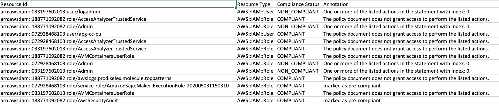
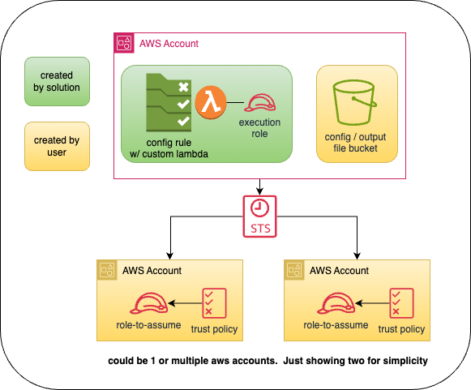

# Check Access Not Granted

CheckAccessNotGranted is a go-lang based solution that will perform a scan against all the iam policies in your account(s) and find any policies which contain actions from the list of restricted actions you specify.  It will publish findings to AWS Config as well as S3. 

Sample `results.csv` output below : 

<div align="center">

</div>

## Table Contents
- [Overview](#overview)
- [Prerequisities](#prerequisites)
    - [S3 Bucket](#s3-bucket)
    - [IAM Role(s)](#iam-roles)
    - [Trust Policy](#trust-policy)
- [Resources Created by AWS SAM Template](#resources-created-by-aws-sam-template)
    - [Custom AWS Config Rule](#custom-aws-config-rule)
    - [Lambda Function](#lambda-function)
    - [Lambda Execution Role](#lambda-execution-role)
- [How to deploy](#how-to-deploy)
- [License](#license)

### Overview 

This solution requires the following components : 

- `checkAccessNotGranted-config.json` file which will initialize the solution with the appropriate values.
```json 
{
    "awsAccounts": [
        {
            "accountId": " enter aws account id",   // account id of member accou t
            "roleArn": " enter valid role arn "     // service role to use for member account
        }
    ],
    "precompliantIamIdentities" : [" enter valid iam principals "],
    "restrictedActions" : ["s3:GetObject", "s3:PutObject"],        
    "testMode" : false,                             // will not publish results to AWS Config if true
    "prefix": "checkAccessNotGranted"               // prefix used to store results in S3 bucket
}
```
- `s3 bucket` located in main account.  This is where the config file will be stored as well as results from each execution 
- `custom aws config rule w/ custom lambda` which performs the scan and reports results to AWS Config & s3 bucket
- `iam service roles w/ trust policy` in member accounts which allows the lambda to assume this role and perform the lookups in the respective account

<div align="center">

</div>

### Prerequisites

Before deploying this solution, ensure your local development environment is equipped with the following: 

- **Go Programming Language (v1.20+)**:
Download and install Go from the [official website](https://go.dev/dl/).

- **AWS SAM CLI**:
Install AWS SAM CLI by following the [AWS SAM CLI Installation Guide](https://docs.aws.amazon.com/serverless-application-model/latest/developerguide/install-sam-cli.html).

#### S3 Bucket
In the main account you will need an S3 bucket to : 
- store the configuration file needed to initialize the solution 
- store results from each execution 

#### IAM Role(s)

In each member account, you will need an IAM policy + a trust policy so that the lambda function can assume this role and perform the lookup in the account.  Below is a working policy example: 

```json 
{
  "Version": "2012-10-17",
  "Statement": [
    {
      "Sid": "iamActions",
      "Effect": "Allow",
      "Action": [
        "iam:ListUserPolicies",
        "iam:ListUsers",
        "iam:ListAttachedUserPolicies",
        "iam:GetUserPolicy",
        "iam:ListRolesPolicies",
        "iam:ListRoles",
        "iam:ListAttachedRolesPolicies",
        "iam:GetRolePolicy",
        "iam:GetPolicy",
        "iam:GetPolicyVersion",
        "access-Analyzer:CheckAccessNotGranted"
      ],
      "Resource": "*"
    }
  ]
}
```

#### Trust Policy

To allow the lambda execution role to assume role via `sts:AssumeRole`, create a trust policy for each member account service role. 

**ATTENTION:** 
You will need the ARN from the lambda function that the AWS SAM template will create.  

Below is an example trust policy: 

```json 
{
  "Version": "2012-10-17",
  "Statement": [
    {
      "Sid" : "trustPolicy",
      "Effect": "Allow",
      "Principal": {
        "AWS": "*** ENTER ARN FOR LAMBDA FUNCTION EXECUTION ROLE HERE ***"
      },
      "Action": "sts:AssumeRole"
    }
  ]
}
```

### Resources Created by AWS SAM Template

Deploying the AWS SAM template will create the following resources: 
- [Custom AWS Config Rule](#custom-aws-config-rule)
- [Lambda Function](#lambda-function)
- [Lambda Execution Role](#lambda-execution-role)

Please read the sections below to see more detailed information about each created resource.

#### Custom AWS Config Rule

- **Name** : checkAccessNotGranted-iamPolicyPatrol
- **Type** : periodic
- **Maximum Execution Frequency** : 24 hours (default)
- **Lamba Function** : see section [Lambda Function](#lambda-function)

#### Lambda Function

- **Name** : checkAccessNotGranted-iamPolicyPatrol
- **Memory Configuration** : 256MB
- **Execution Role** - see section [Lambda Execution Role](#lambda-execution-role)

#### Lambda Execution Role

Below are the permissions used for the lambda function execution role

```json 
{
    "Version": "2012-10-17",
    "Statement": [
        {
            "Action": [
                "logs:CreateLogGroup",
                "logs:CreateLogStream",
                "logs:PutLogEvents"
            ],
            "Resource": "*",
            "Effect": "Allow",
            "Sid": "cloudWatchLogs"
        },
        {
            "Action": [
                "s3:GetObject",
                "s3:PutObject",
            ],
            "Resource": "*",
            "Effect": "Allow",
            "Sid": "s3BucketActions"
        },
        {
            "Action": [
                "iam:ListUserPolicies",
                "iam:ListUsers",
                "iam:ListAttachedUserPolicies",
                "iam:ListRolePolicies",
                "iam:ListRoles",
                "iam:ListAttachedRolePolicies",
                "iam:GetPolicy",
                "iam:GetPolicyVersion",
                "access-Analyzer:CheckAccessNotGranted",
                "sts:AssumeRole"
            ],
            "Resource": "*",
            "Effect": "Allow",
            "Sid": "iamSTSActions"
        },
        {
            "Action": [
                "config:PutEvaluations",
            ],
            "Resource": "*",
            "Effect": "Allow",
            "Sid": "configActions"
        },
    ]
}
```

### How it works

Once deployed, the solution will : 
- read `checkAccessNotGranted-config.json` from s3 bucket by looking for the bucket name & file object key in the environment variables 
- loop through all the iam principals across all accounts in seperate go-routines & send each iam principal to a worker to processed
- each worker will scan the managed & inline policies attached to the iam principal and will create an aws config evaluation based on the results
- publish results to AWS Config & s3
- any errors during execution will also be published to s3

### How to Deploy 

After forking the repo, go to the `./deployment/checkaccessnotgranted` directory.  From there you will need to run these two commands: 

- sam build 
- sam deploy 

### License 